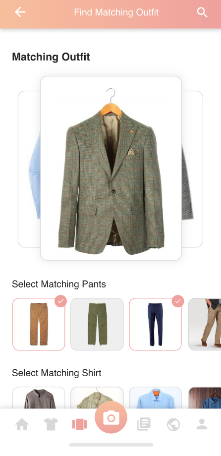
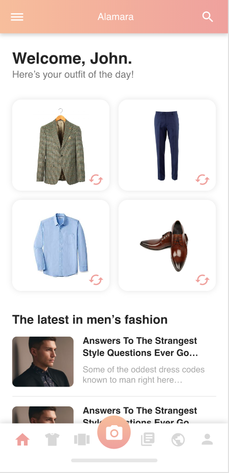
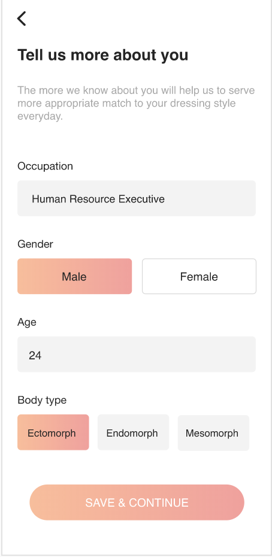
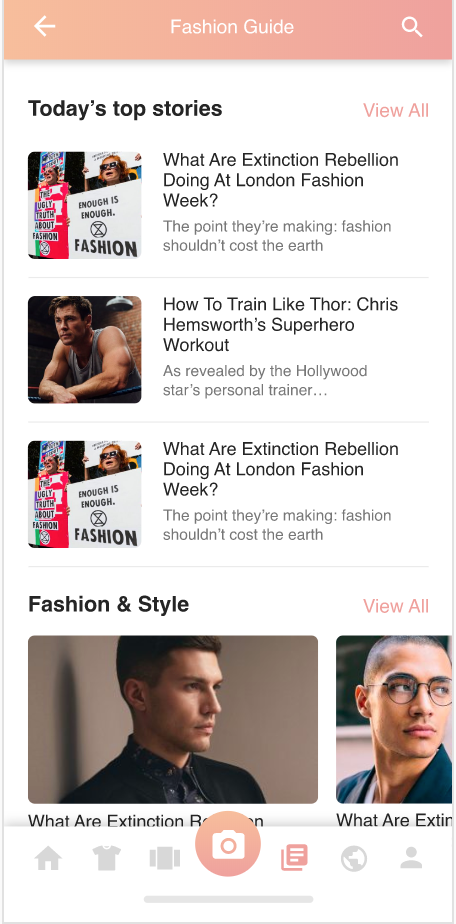

# Wardrobe

A digital wardrobe theme built in flutter for iOS and android

# 

  
   
  
  
  

# Steps to run

### 1. Clone `git@github.com:MuhammadSaadQadeer/Wardrobe.git` and `cd` in `Wardrobe` folder

### 2. Run command `open -a Simulator` to open the simulator for iOS

### 3. Run command `flutter run` to run the application on iOS simulator

